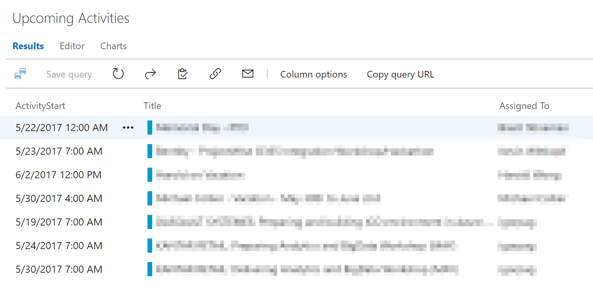
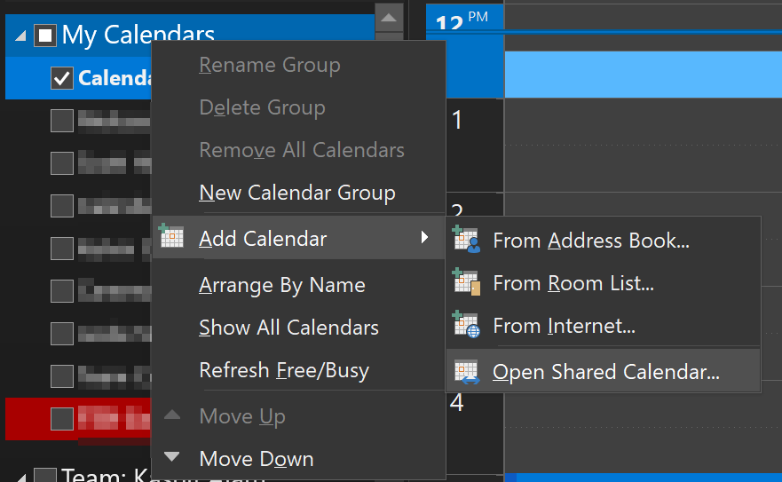
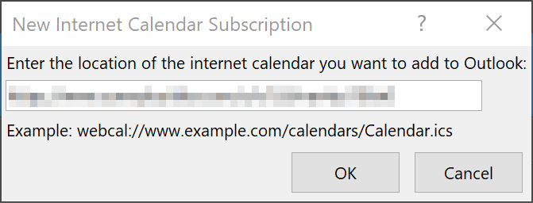
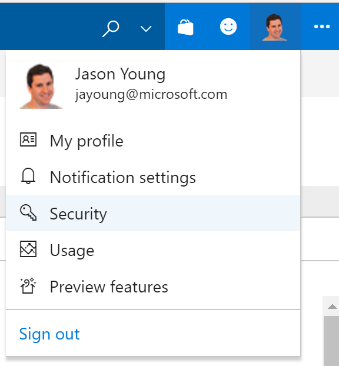
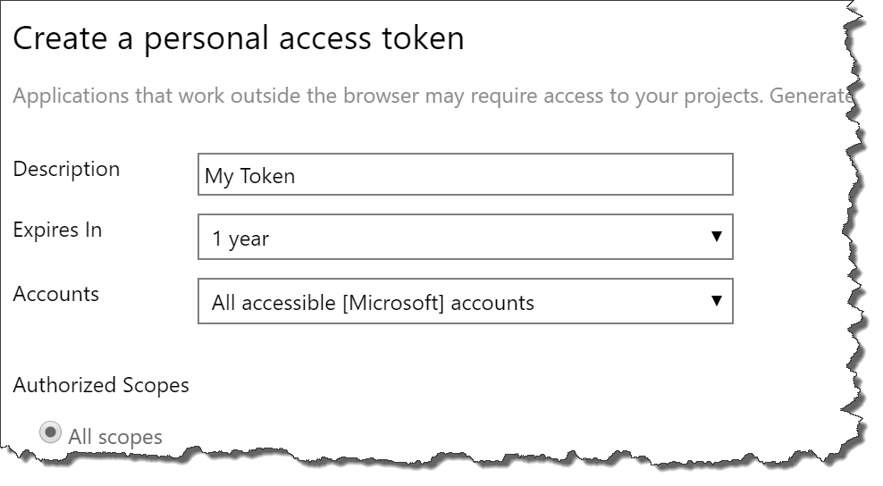

# VSTS Activities to iCal

This is an [Azure Function](https://azure.microsoft.com/en-us/services/functions/) project to enable Outlook or other calendars to read VSTS activities as an iCal (.ics) feed.

The idea is to take a list of activities in VSTS

Add to Outlook:

## Customizing

The code makes a number of assumptions about the configuration of your VSTS instance.

Customize [vstsCalGen.js](GenerateIcs/vstsCalGen.js) to set up the mappings between your fields in the iCal fields.

# URL Parameters

* `calendarname`: The name you want to show up in Outlook (or another calendar app)
* `token`: See 'Creating a PAT' below.
* `sitename`: https://**mysite**.visualstudio.com/DefaultCollection/My%20Project/_workItems
* `project`: https://mysite.visualstudio.com/DefaultCollection/**My%20Project**/_workItems
* `queryid`: https://mysite.visualstudio.com/DefaultCollection/My%20Project/_workItems?id=**24d55f1c-2124-457e-b110-0b4c978a5416**&_a=query

Note: You can also set these paramters as [application settings](https://docs.microsoft.com/en-us/azure/azure-functions/functions-how-to-use-azure-function-app-settings) for your function.

# Creating a Personal Access Token (PAT)

